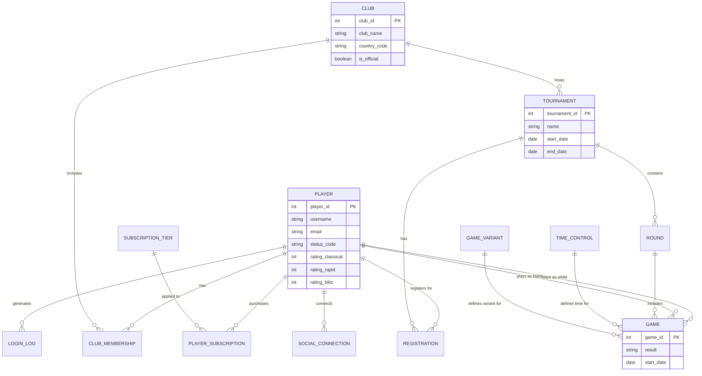
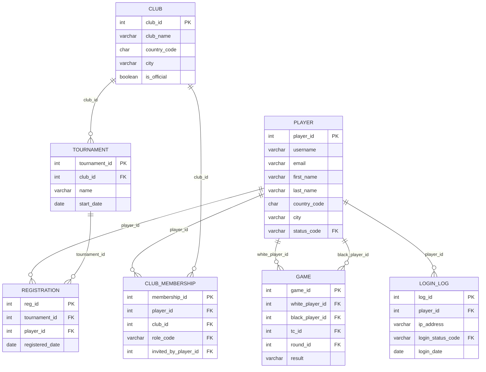

# תרשימים משולבים - שלב ג'

להלן קוד Mermaid המייצג את התרשימים המשולבים.
גיטהאב (GitHub) תומך בהצגת תרשימים אלו באופן אוטומטי. ניתן גם להעתיק את הקוד לאתר [Mermaid Live Editor](https://mermaid.live/) כדי לייצא אותם לתמונות.

> **טיפ חשוב לגבי ERDPlus:** אם ברצונכם להפיק את ה-DSD המדויק בתוך תוכנת **ERDPlus**, פשוט היכנסו לתוכנה, בחרו ב-**Import from SQL**, והדביקו לשם את התוכן של קובצי יצירת הטבלאות (כולל `Integrate.sql`). התוכנה תיצור את ה-DSD אוטומטית!

## 1. תרשים ישויות-קשרים משולב (ERD משותף)

## 2. תרשים סכמה משולבת לאחר האינטגרציה (DSD)

