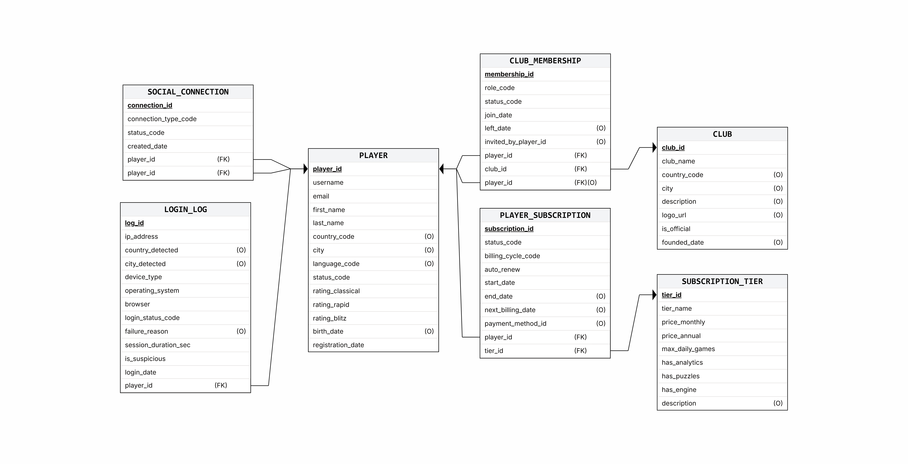
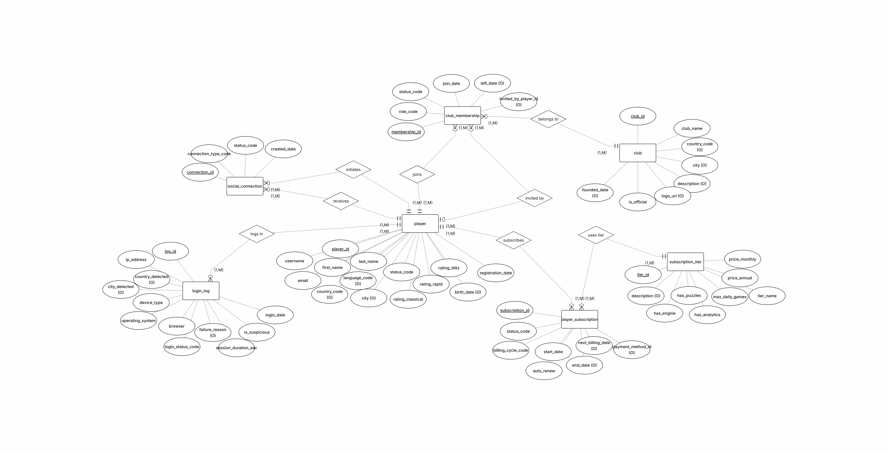
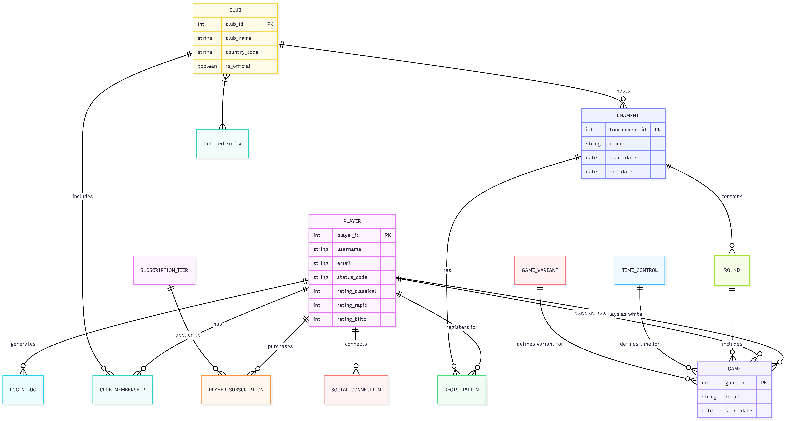
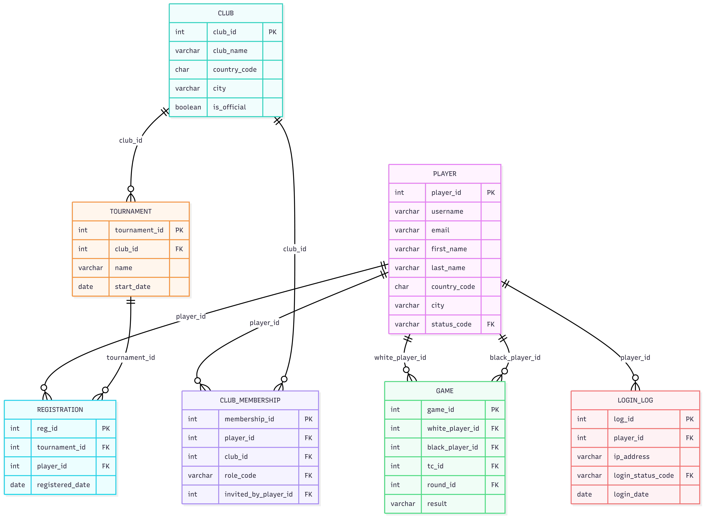
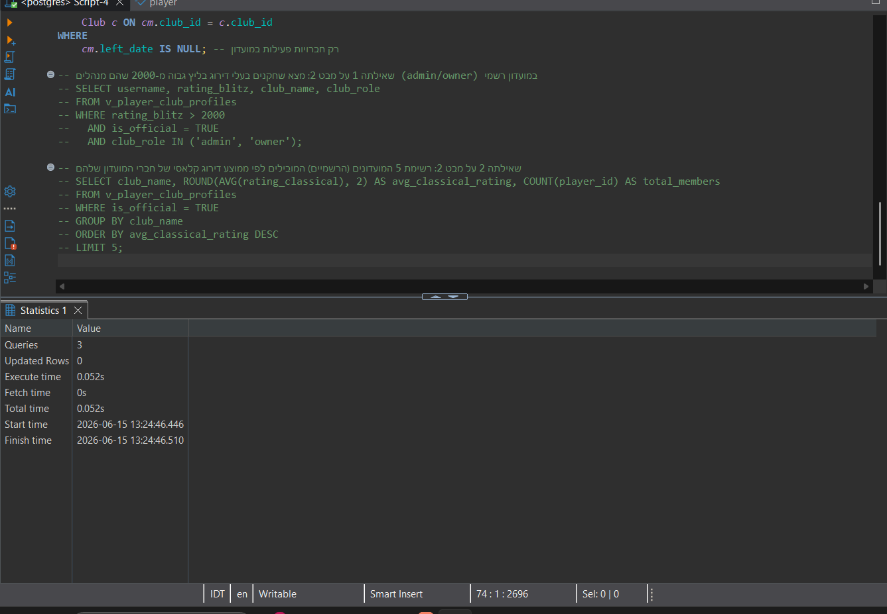

# דוח פרויקט - שלב ג' (אינטגרציה ומבטים)

## מבוא
בשלב זה של הפרויקט, שילבנו שתי מערכות שחמט שונות לבסיס נתונים רלציוני אחד משותף. 
* **המערכת שלנו:** תחרויות ומשחקים (Tournaments and Games).
* **המערכת שהתקבלה:** משתמשים ומועדונים (Users and Clubs) - של זוג 8309_7002.

## אלגוריתם הנדסה לאחור (Reverse Engineering) - מ-DSD ל-ERD
מתוך קובץ היצירה (הסכמה/DSD) של מערכת "משתמשים ומועדונים" שקיבלנו, שחזרנו את ה-ERD על ידי האלגוריתם הבא:
1. **זיהוי ישויות חזקות:** טבלאות ללא מפתחות זרים כחלק מהמפתח הראשי הומרו לישויות עצמאיות (כמו `Player` ו-`Club`).
2. **זיהוי ישויות מקשרות וקשרי M:N:** טבלאות המכילות מספר מפתחות זרים (כמו `club_membership` המקשרת בין שחקן למועדון) הומרו לישויות חלשות/מקשרות ב-ERD המשקפות קשרי רבים-לרבים.
3. **זיהוי קשרי 1:N:** כל מפתח זר (`Foreign Key`) הצביע על קשר 1:N בין הטבלה המצביעה לטבלת היעד.
4. **זיהוי מאפיינים (Attributes):** כל שאר העמודות הרגילות הומרו למאפיינים (אליפסות) ב-ERD, ומפתחות ראשיים סומנו בקו תחתון.
5. **טבלאות ייחוס (Lookup Tables):** טבלאות כמו `player_status` זוהו כמילוני נתונים ולא כישויות עצמאיות, והוטמעו במודל כמאפיינים (Enum) מוגבלי תחום.

## החלטות שנעשו בשלב האינטגרציה
במקום למחוק את הטבלאות המקוריות שלנו, ביצענו את ההחלטות העיצוביות הבאות כדי לשמור על שלמות הנתונים:
1. **הרחבת טבלאות משותפות:** שתי המערכות חולקות את הישויות `Player` ו-`Club`. החלטנו להשתמש בטבלאות הקיימות שלנו ולהרחיב אותן בעזרת פקודות `ALTER TABLE ADD COLUMN`, כדי לקלוט את כל המידע העשיר מהמערכת השנייה (דירוגים, תאריכי לידה, אימיילים, ועוד).
2. **יצירת טבלאות נלוות:** שאר הטבלאות מהמערכת המקבילה (`club_membership`, `login_log`, מילוני הסטטוסים) נוצרו מחדש באמצעות סקריפט ה-`Integrate.sql` וקושרו לטבלאות שלנו.
3. **תאימות מפתחות:** שמרנו על המפתחות הראשיים והזרים מטיפוס `INT` על מנת לשמור על תאימות מלאה לסכמה הקיימת שלנו, גם כאשר המערכת השנייה השתמשה ב-`BIGINT`.

## תיאור המבטים (Views)
יצרנו שני מבטים וביצענו 4 שאילתות משמעותיות, כמפורט להלן (מופיעות בקובץ `Views.sql` וכן תוצאותיהן ב-`Views.png`):

### 1. v_tournament_details (מנקודת המבט המקורית שלנו)
* **תיאור:** משלב את `Tournament`, `Club`, ו-`Registration` כדי להציג מידע מרוכז על תחרויות, כולל המועדון המארח וספירה של מספר השחקנים שנרשמו אליהן.
* **שאילתא 1:** הצגת תחרויות מ-2024 שנרשמו אליהן לפחות 10 שחקנים.
* **שאילתא 2:** חישוב הממוצע של מספר השחקנים הנרשמים לכל תחרות לפי מועדון מארח (כדי להציג פופולריות של מועדונים).

### 2. v_player_club_profiles (מנקודת המבט החדשה שנוספה)
* **תיאור:** משלב את `Player`, `Club`, ו-`club_membership` ומציג את הפרופיל המלא של שחקנים, כולל המועדון שבו הם חברים, תפקידם במועדון (חבר/מנהל), והאם זהו מועדון רשמי.
* **שאילתא 1:** שליפת מנהלים/בעלים במועדונים רשמיים שהדירוג שלהם בבליץ גבוה מ-2000.
* **שאילתא 2:** דירוג של 5 המועדונים (הרשמיים) המובילים לפי ממוצע הדירוג הקלאסי של השחקנים החברים בהם.

## תוצרים שנוספו לתיקייה
1. `Integrate.sql` - פקודות מיזוג בסיסי הנתונים.
2. `Views.sql` - קוד המבטים והשאילתות.
3. `Views.png` - צילומי מסך מהרצת המבטים והשאילתות ב-pgAdmin.
4. `backup3.sql` - גיבוי סופי של המערכת המשולבת לאחר הזנת נתונים (נתונים מקוריים + אינטגרציה).
5. דיאגרמות ERD ו-DSD לפני האינטגרציה, ודיאגרמות בתצורת Mermaid במסמך `Combined_Diagrams.md`.

## נספחים - צילומי מסך ותרשימים

### תרשימים של המערכת המקורית שהתקבלה

### תרשימים משולבים לאחר האינטגרציה

### תוצאות המבטים והשאילתות

