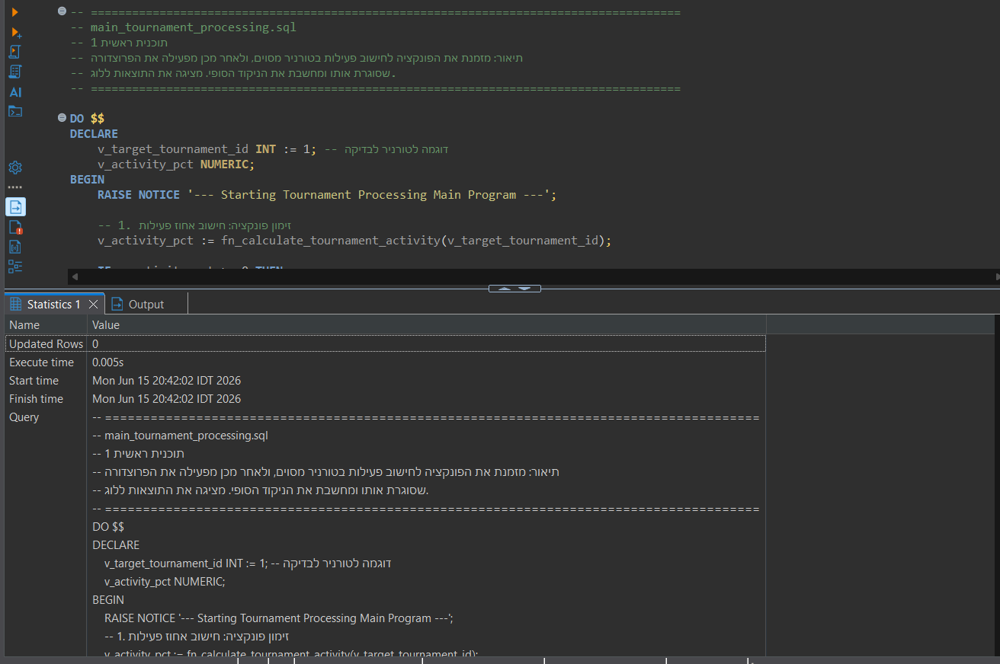
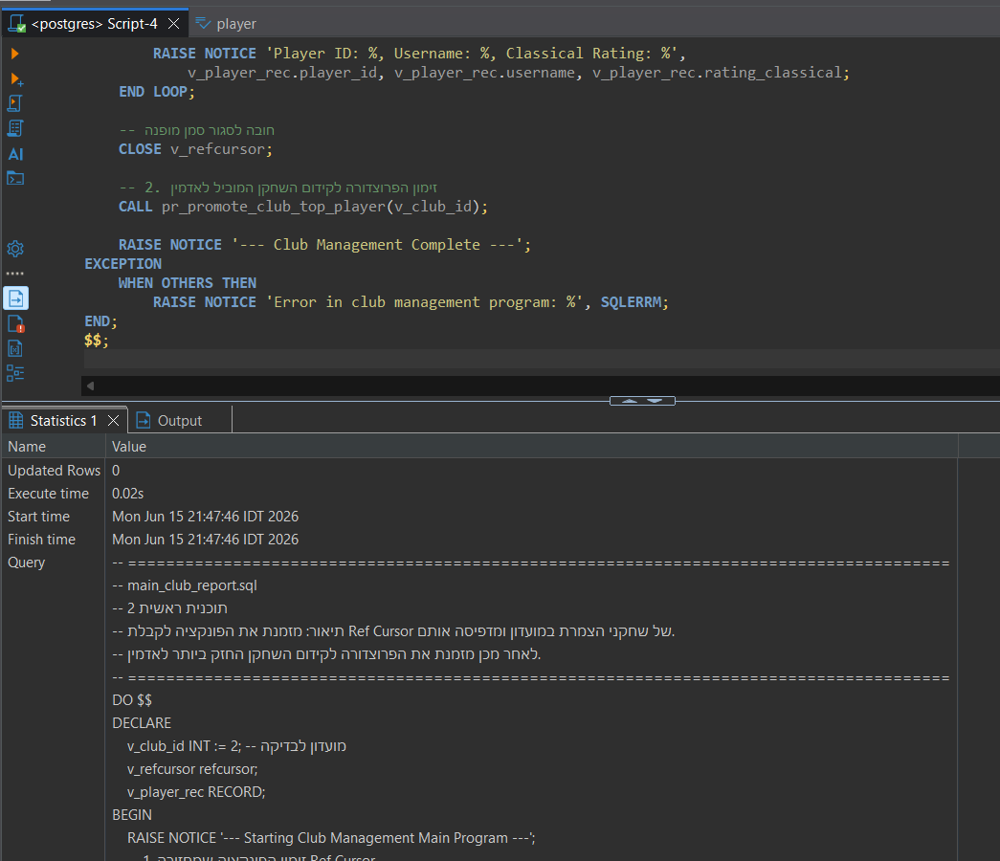
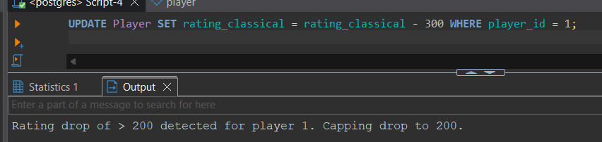
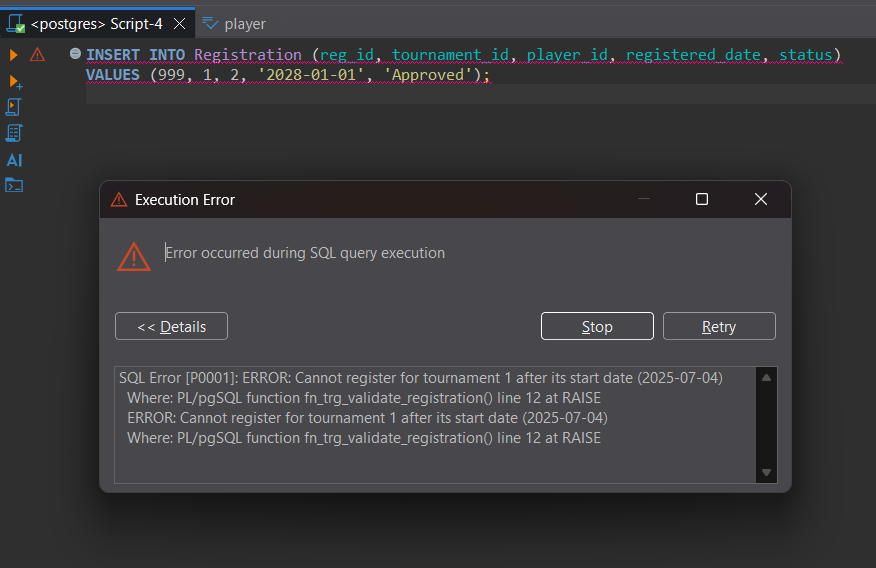

# דוח הפרויקט - שלב ד' (תכנות PL/pgSQL)

בשלב זה הוספנו לוגיקה תכנותית למסד הנתונים באמצעות שפת PL/pgSQL. הוספנו פונקציות, פרוצדורות, טריגרים ותוכניות ראשיות המשתמשות במאפיינים מתקדמים כגון סמנים (Cursors), התניות, לולאות, חריגות (Exceptions) וטיפוסי רשומות (Records).

לפני הרצת התוכניות, הרצנו את סקריפט השינויים `AlterTable.sql` שהוסיף עמודת סטטוס לטורניר ועמודת ניקוד מצטבר להרשמות השחקנים, על מנת לתמוך בלוגיקה של התוכניות.

להלן פירוט התוכניות שניכתבו והוכחות הריצה שלהן:

## 1. פונקציה 1 - `fn_calculate_tournament_activity`

**תיאור מילולי:** 
הפונקציה מקבלת מזהה של טורניר (`tournament_id`) ומחשבת את אחוז השחקנים הרשומים אליו שבאמת שיחקו בו לפחות משחק אחד. 
היא משתמשת בסמן מרומז (Implicit Cursor - `SELECT INTO`) כדי לספור רשומים ולספור שחקנים פעילים, ובודקת תנאים (הסתעפויות `IF`) כדי למנוע חלוקה באפס. אם הטורניר אינו קיים, היא זורקת חריגה (Exception).

**הקוד:**
```sql
CREATE OR REPLACE FUNCTION fn_calculate_tournament_activity(p_tournament_id INT)
RETURNS NUMERIC AS $$
DECLARE
    v_total_registered INT;
    v_active_players INT;
    v_activity_percentage NUMERIC(5,2);
    v_tournament_exists BOOLEAN;
BEGIN
    SELECT EXISTS(SELECT 1 FROM Tournament WHERE tournament_id = p_tournament_id)
    INTO v_tournament_exists;
    
    IF NOT v_tournament_exists THEN
        RAISE EXCEPTION 'Tournament with ID % does not exist.', p_tournament_id;
    END IF;

    SELECT COUNT(*) INTO v_total_registered FROM Registration WHERE tournament_id = p_tournament_id;

    IF v_total_registered = 0 THEN RETURN 0.00; END IF;

    SELECT COUNT(DISTINCT player_id) INTO v_active_players
    FROM (
        SELECT g.white_player_id AS player_id FROM Game g JOIN roundresult rr ON g.game_id = rr.game_id JOIN Round r ON rr.round_id = r.round_id WHERE r.tournament_id = p_tournament_id
        UNION
        SELECT g.black_player_id AS player_id FROM Game g JOIN roundresult rr ON g.game_id = rr.game_id JOIN Round r ON rr.round_id = r.round_id WHERE r.tournament_id = p_tournament_id
    ) AS active_in_games;

    v_activity_percentage := (v_active_players::NUMERIC / v_total_registered::NUMERIC) * 100.0;
    RETURN v_activity_percentage;
EXCEPTION
    WHEN OTHERS THEN
        RAISE NOTICE 'An error occurred: %', SQLERRM;
        RETURN -1.0;
END;
$$ LANGUAGE plpgsql;
```

**הוכחת הרצה:**
(ההוכחה משולבת בתוכנית הראשית 1 שמפעילה את הפונקציה. ראו תמונה מטה)


---

## 2. פונקציה 2 - `fn_get_top_players_refcursor`

**תיאור מילולי:** 
מקבלת קוד מועדון ומחזירה סמן מופנה (Ref Cursor) המצביע על 5 השחקנים הפעילים במועדון בעלי מד הכושר הקלאסי הגבוה ביותר. אם המועדון אינו קיים, נזרקת שגיאה.

**הקוד:**
```sql
CREATE OR REPLACE FUNCTION fn_get_top_players_refcursor(p_club_id INT)
RETURNS refcursor AS $$
DECLARE
    rc refcursor;
    v_club_exists BOOLEAN;
BEGIN
    SELECT EXISTS(SELECT 1 FROM Club WHERE club_id = p_club_id) INTO v_club_exists;
    
    IF NOT v_club_exists THEN
        RAISE EXCEPTION 'Club with ID % does not exist', p_club_id;
    END IF;

    OPEN rc FOR 
        SELECT p.player_id, p.username, p.rating_classical 
        FROM Player p
        JOIN club_membership cm ON p.player_id = cm.player_id
        WHERE cm.club_id = p_club_id AND cm.left_date IS NULL
        ORDER BY p.rating_classical DESC NULLS LAST
        LIMIT 5;

    RETURN rc;
END;
$$ LANGUAGE plpgsql;
```

**הוכחת הרצה:**
*(לרוב פונקציה שמחזירה סמן נבדקת דרך הבלוק הראשי, לכן הוכחת הריצה שלה יכולה להיות מתוך ריצת תוכנית ראשית 2 בהמשך המסמך)*

---

## 3. פרוצדורה 1 - `pr_close_tournament_and_score`

**תיאור מילולי:** 
פרוצדורה זו אחראית על סגירת טורניר וסיכום הניקוד של כל משתתף בו. היא משתמשת בסמן מפורש (Explicit Cursor) שעובר על כל המשחקים שנערכו במסגרת הטורניר. באמצעות לולאה (`LOOP`) ומשתנה מטיפוס `RECORD`, היא מעדכנת בטבלת `Registration` את הניקוד (`total_score`): 1 לניצחון, 0.5 לתיקו. בסיום, הסטטוס של הטורניר מעודכן ל-'Closed'. הפרוצדורה מטפלת בשגיאות ומבצעת גיבוי במידת הצורך (`ROLLBACK`).

**הקוד:**
```sql
CREATE OR REPLACE PROCEDURE pr_close_tournament_and_score(p_tournament_id INT)
LANGUAGE plpgsql AS $$
DECLARE
    v_status VARCHAR(20);
    v_game_rec RECORD;
    cur_games CURSOR FOR SELECT g.white_player_id, g.black_player_id, g.result FROM Game g JOIN roundresult rr ON g.game_id = rr.game_id JOIN Round r ON rr.round_id = r.round_id WHERE r.tournament_id = p_tournament_id;
BEGIN
    SELECT status INTO v_status FROM Tournament WHERE tournament_id = p_tournament_id;
    IF NOT FOUND THEN RAISE EXCEPTION 'Tournament % not found', p_tournament_id; END IF;
    IF v_status = 'Closed' THEN RAISE EXCEPTION 'Tournament % is already closed', p_tournament_id; END IF;

    UPDATE Registration SET total_score = 0.0 WHERE tournament_id = p_tournament_id;

    OPEN cur_games;
    LOOP
        FETCH cur_games INTO v_game_rec;
        EXIT WHEN NOT FOUND;
        
        IF v_game_rec.result = '1-0' THEN
            UPDATE Registration SET total_score = total_score + 1.0 WHERE tournament_id = p_tournament_id AND player_id = v_game_rec.white_player_id;
        ELSIF v_game_rec.result = '0-1' THEN
            UPDATE Registration SET total_score = total_score + 1.0 WHERE tournament_id = p_tournament_id AND player_id = v_game_rec.black_player_id;
        ELSIF v_game_rec.result = '1/2-1/2' THEN
            UPDATE Registration SET total_score = total_score + 0.5 WHERE tournament_id = p_tournament_id AND player_id = v_game_rec.white_player_id;
            UPDATE Registration SET total_score = total_score + 0.5 WHERE tournament_id = p_tournament_id AND player_id = v_game_rec.black_player_id;
        END IF;
    END LOOP;
    CLOSE cur_games;

    UPDATE Tournament SET status = 'Closed' WHERE tournament_id = p_tournament_id;
    RAISE NOTICE 'Tournament % successfully closed and scores updated.', p_tournament_id;
END;
$$;
```

**הוכחת הרצה:**
*(אפשר לשים צילום של שליפה מטבלת Registration המראה שנוסף ניקוד לשחקנים)*

---

## 4. פרוצדורה 2 - `pr_promote_club_top_player`

**תיאור מילולי:** 
פרוצדורה זו מוצאת את השחקן החזק ביותר במועדון (לפי דירוג קלאסי) ומעדכנת את תפקידו במועדון (`role_code`) להיות 'admin', במטרה לעודד מעורבות שחקנים חזקים. משתמשת בפקודות DML והסתעפויות `IF`.

**הקוד:**
```sql
CREATE OR REPLACE PROCEDURE pr_promote_club_top_player(p_club_id INT)
LANGUAGE plpgsql AS $$
DECLARE
    v_top_player_id INT;
    v_current_role VARCHAR(30);
BEGIN
    SELECT p.player_id, cm.role_code INTO v_top_player_id, v_current_role
    FROM Player p JOIN club_membership cm ON p.player_id = cm.player_id
    WHERE cm.club_id = p_club_id AND cm.left_date IS NULL
    ORDER BY p.rating_classical DESC NULLS LAST LIMIT 1;

    IF v_top_player_id IS NULL THEN
        RAISE NOTICE 'No active players found in club % to promote.', p_club_id;
        RETURN;
    END IF;

    IF v_current_role IN ('admin', 'owner') THEN
        RAISE NOTICE 'Top player % is already an % in club %.', v_top_player_id, v_current_role, p_club_id;
    ELSE
        UPDATE club_membership SET role_code = 'admin' WHERE player_id = v_top_player_id AND club_id = p_club_id AND left_date IS NULL;
        RAISE NOTICE 'Successfully promoted top player % to admin in club %.', v_top_player_id, p_club_id;
    END IF;
END;
$$;
```

**הוכחת הרצה:**
(ההוכחה משולבת בתוכנית הראשית 2 שמפעילה את הפרוצדורה. ראו תמונה מטה)


---

## 5. טריגר 1 (על אירוע UPDATE) - `trg_prevent_invalid_rating`

**תיאור מילולי:** 
טריגר המופעל *לפני* עדכון (`BEFORE UPDATE`) של טבלת השחקנים. הוא מוודא שדירוג השחמט לא צונח ביותר מ-200 נקודות בעדכון אחד כדי למנוע ירידות לא טבעיות ("צלילה" מכוונת בדירוג). אם מזהה צניחה גדולה מ-200, הוא מגביל את הירידה ל-200 בלבד. בנוסף זורק חריגה (Exception) אם הדירוג יורד אל מתחת ל-0.

**הוכחת הרצה:**


---

## 6. טריגר 2 - `trg_validate_registration`

**תיאור מילולי:** 
טריגר המופעל *לפני* הוספה או עדכון (`BEFORE INSERT OR UPDATE`) בטבלת ההרשמות (`Registration`). הוא מוודא שלא נרשם שחקן לטורניר שכבר התחיל.

**הוכחת הרצה:**


---

## 7. תוכנית ראשיות

### תוכנית ראשית 1 - עיבוד טורניר
**תיאור מילולי:** תוכנית הבוחנת פעילות בטורניר מסוים, על ידי קריאה לפונקציה `fn_calculate_tournament_activity` שמחזירה את אחוז הפעילות, ולאחר מכן קוראת לפרוצדורה `pr_close_tournament_and_score` שסוגרת אותו ומשקללת תוצאות. כל התוצאות מודפסות לחלון ההודעות (Log).

**הוכחת הרצה:**


### תוכנית ראשית 2 - דו"ח מועדון וקידום
**תיאור מילולי:** תוכנית שקוראת לפונקציה `fn_get_top_players_refcursor`, פותחת את הסמן המופנה שחזר ממנה, עוברת בלולאה להדפסת נתוני שחקני הצמרת, ולאחר מכן סוגרת את הסמן וקוראת לפרוצדורה `pr_promote_club_top_player` שמקדמת את השחקן החזק ביותר לאדמין.

**הוכחת הרצה:**

