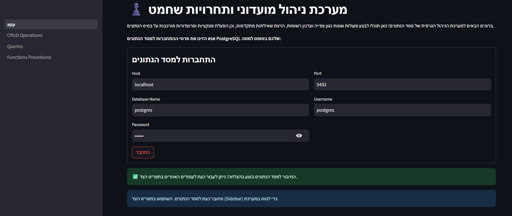
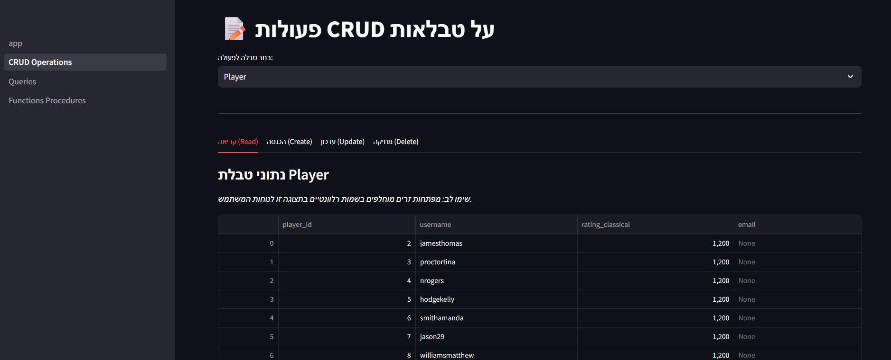
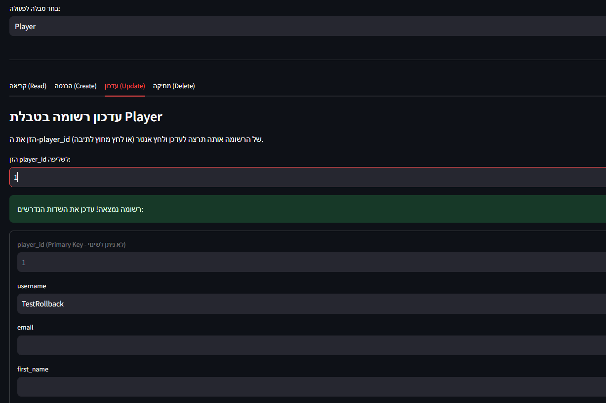
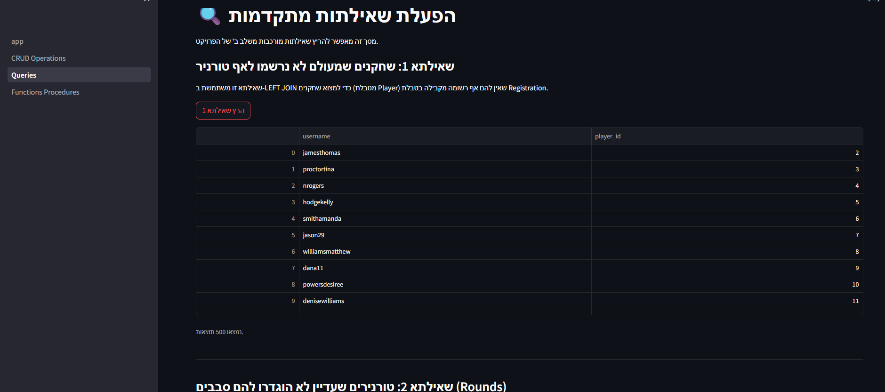
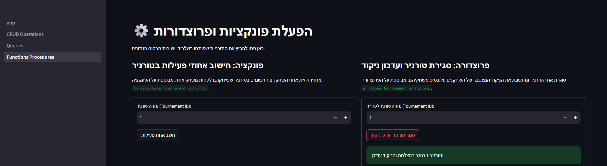

# שלב ה' - ממשק משתמש (GUI) למערכת בסיס הנתונים

בשלב זה פותח ממשק משתמש גרפי המאפשר עבודה נוחה מול בסיס הנתונים (PostgreSQL) של מערכת התחרויות והשחקנים.
הממשק נכתב בשפת Python באמצעות ספרית **Streamlit**, אשר מספקת עיצוב מודרני, נקי ואינטראקטיבי, בהתאם לדרישות לממשק יפה וקל לשימוש.
לצורך תקשורת מול המסד נעשה שימוש בספרית **psycopg2** ו-**pandas** לצורך עיבוד וייצוג טבלאי של המידע.

## הוראות התקנה והפעלה

1. ודאו שמותקן אצלכם Python בגירסה 3.8 ומעלה.
2. פתחו את מסוף הפקודות (Terminal) בנווט לתיקייה `שלב ה`.
3. התקינו את ספריות החובה על ידי הרצת הפקודה הבאה:
   ```bash
   pip install -r requirements.txt
   ```
4. הריצו את האפליקציה על ידי הפקודה:
   ```bash
   streamlit run app.py
   ```
5. דפדפן האינטרנט יפתח אוטומטית בכתובת המקומית (לרוב `http://localhost:8501`).
6. במסך הראשי הזינו את פרטי ההתחברות למסד הנתונים המקומי שלכם (PostgreSQL) ולחצו על התחברות.

## מבנה המערכת והסבר על דרך העבודה
האפליקציה בנויה כמערכת מרובת-דפים (Multi-page app). הניווט מתבצע דרך תפריט צדדי שמספק מעבר בין המסכים:

* **מסך בית (app.py)**: משמש כמסך התחברות. שומר את פרטי ההתחברות (Credentials) ב-Session State כך שכל שאר הדפים יוכלו להשתמש בחיבור.
* **1_CRUD_Operations**: מסך מרכזי המאפשר 4 פעולות (Read, Create, Update, Delete) על טבלאות נבחרות מהמסד. כנדרש, בשליפת הנתונים מוצגים שמות משמעותיים (כמו שמות שחקנים ומועדונים) במקום מספרי זהות (IDs) זרים. בעת עדכון, המשתמש מזין מפתח, והמערכת שואבת את הנתונים הקיימים כדי להקל על העדכון.
* **2_Queries**: מסך המריץ שאילתות נבחרות משלב ב' של הפרויקט, ומציג את התוצאות בטבלאות מעוצבות.
* **3_Functions_Procedures**: מסך שנועד להפעלת תוכניות ה-PL/pgSQL שנכתבו בשלב ד', כגון סגירת טורניר והרצת חישובים. הוא מאפשר הזנת פרמטרים ולוכד הודעות הצלחה או שגיאה חזרה מהמסד.

## צילומי מסך

- **תמונת מסך של דף ההתחברות:**


- **תמונת מסך של שליפת נתונים והצגת שמות (CRUD - Read):**


- **תמונת מסך של עדכון רשומה:**


- **תמונת מסך של הרצת שאילתות:**


- **תמונת מסך של הרצת פונקציה/פרוצדורה:**

